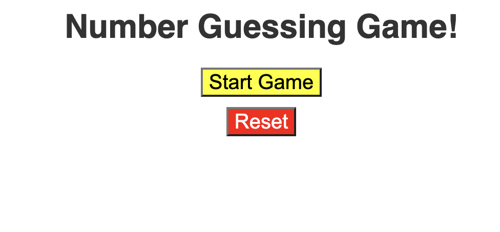
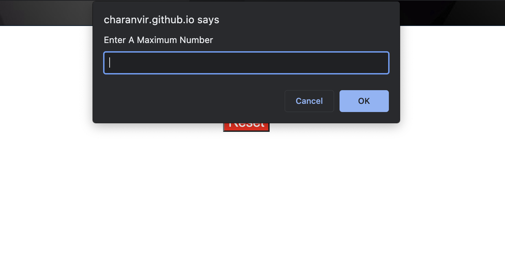
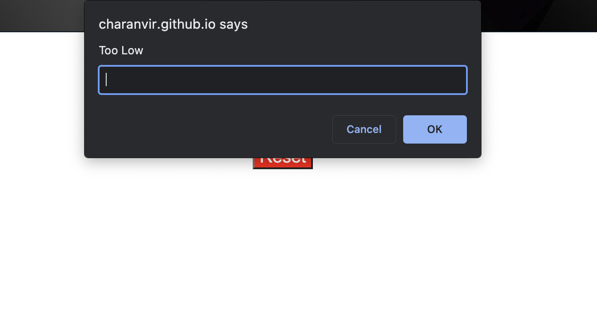
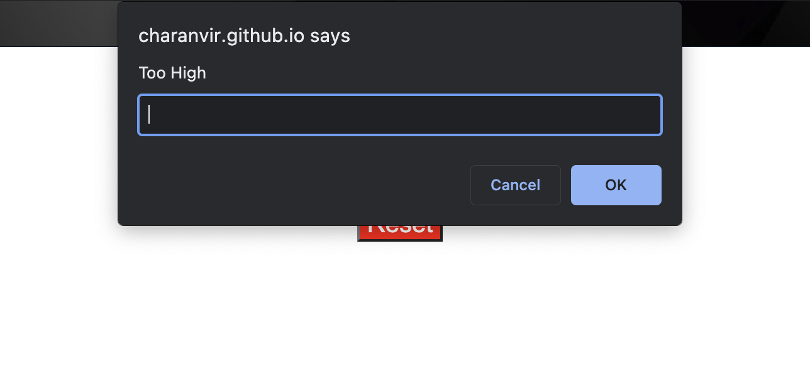
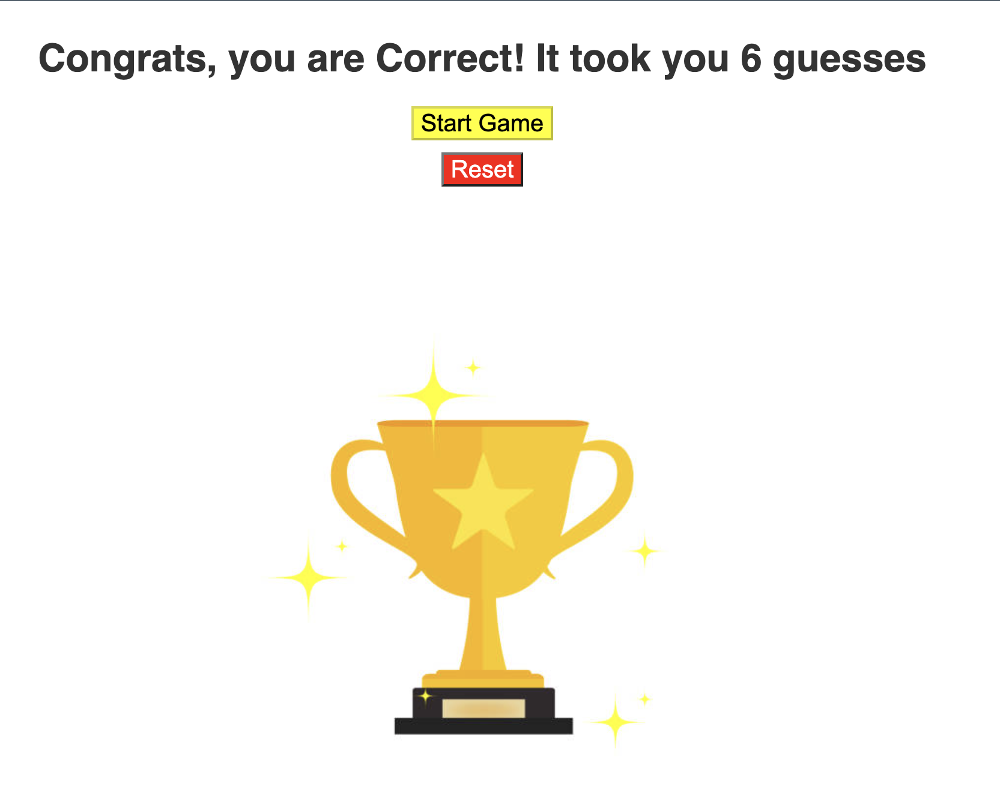

# Number-Guessing-Game

## A number guessing game created using JavaScript. 

This application is a JavaScript game that is user interactive. The user is prompted to enter a maximum number for the game to begin. They are then prompted to guess a number between 1 and the maximum number they entered. They will be told if their guess it too high or low. When they finally guess the correct number, they will be told how many tries it took to guess the correct number. 

The following is a link to the deployed application: https://charanvir.github.io/Number-Guessing-Game/

Below are screenshots of the deployed application:
- 

- 

- 

- 

- 
